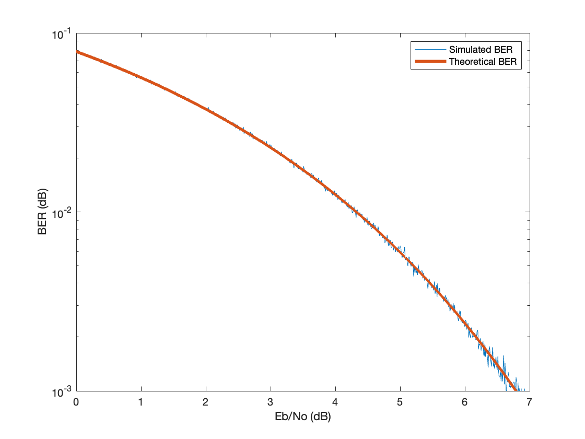

# Simulate BER
 Simulates the BER of an antipodal communication system subject to AWGN. Here is the result of the simulation. Uses the [LSFR code from Nikesh bajaj](https://github.com/Nikeshbajaj/Linear_Feedback_Shift_Register)
 
 
 
 The orange line is the theoretical result using the q function and the blue line is the simulated average over 100 iterations. Notice the increased variance at lower BER since there are not enough samples to obtain an accurate mean.

